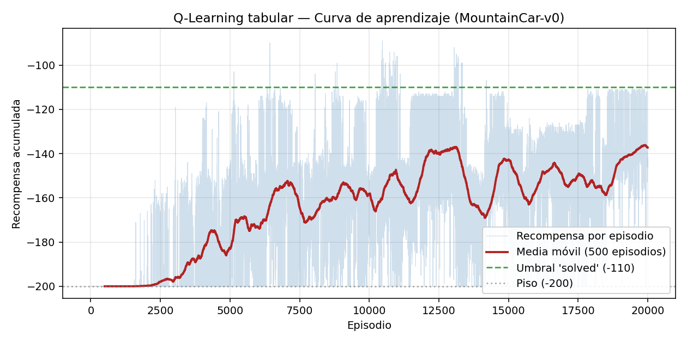
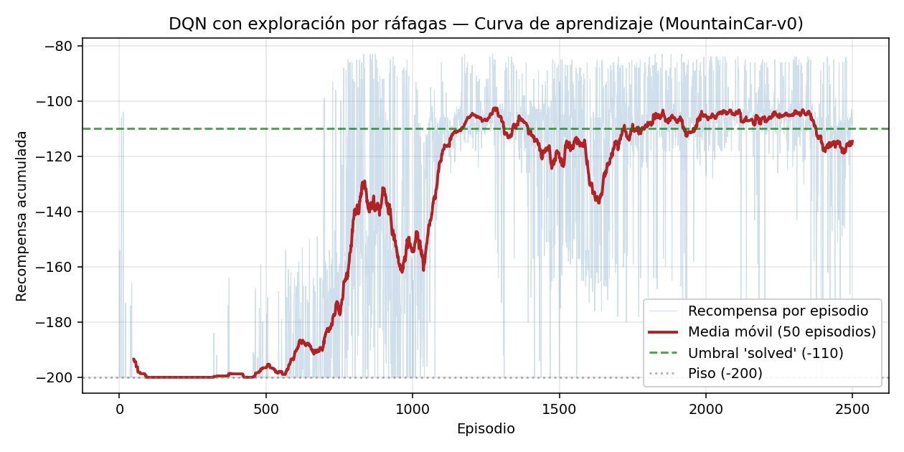
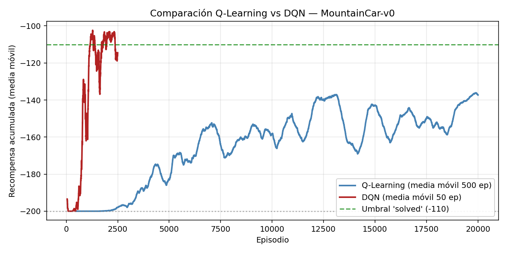

# Taller 1 — MountainCar con Q-Learning y DQN

**Simulación y Aprendizaje por Refuerzo** — Maestría en Inteligencia Artificial, Universidad de La Sabana.
Autor: Ivan Enrique Rangel Santos.

En este proyecto implementé y comparé dos agentes de aprendizaje por refuerzo sobre el conocido entorno MountainCar-v0 de Gymnasium. Por un lado, desarrollé un enfoque clásico tabular (Q-Learning con discretización del espacio de estados) y, por el otro, un enfoque de aprendizaje profundo (DQN), equipado con red neuronal, experience replay y target network.
Todo el trabajo lo ejecuté sobre el repositorio pedagógico de emiliomunozai/mountain_car. La gran ventaja de este repo es que ya trae toda la infraestructura lista (la interfaz de línea de comandos, los bucles de entrenamiento, los métodos para guardar y cargar modelos, y el sistema de logging), dejando los algoritmos principales como huecos vacíos que me tocó completar.
En este repositorio vas a encontrar esos huecos ya resueltos por mí, junto con el análisis detallado del ejercicio de diagnóstico del DQN y toda la evidencia de su entrenamiento.

## Contenido del repo

```
├── src/mountain_car/
│   ├── cli.py                       # CLI (sin cambios respecto al base)
│   └── agents/
│       ├── qlearning.py             # Q-Learning tabular — 3 stubs implementados
│       └── dqn.py                   # DQN — 2 stubs implementados + fix Ejercicio 3
├── saves/
│   ├── qlearning.pkl                # agente Q-Learning entrenado (20 000 eps)
│   ├── qlearning_metrics.pkl        # historia de recompensas y métricas de evaluación
│   ├── dqn.pt                       # agente DQN entrenado (2 500 eps)
│   └── dqn_metrics.pkl              # historia de recompensas y métricas de evaluación
├── qlearning_curve.png              # curva de aprendizaje de Q-Learning
├── dqn_curve.png                    # curva de aprendizaje de DQN
├── comparison.png                   # comparación en un mismo plano
├── GUION_DIBUJOS.md                 # guion detallado para los dos dibujos hechos a mano
├── dibujos/                         # dibujos propios (Q-Learning y DQN) — se agregan aparte
├── run_ql.py                        # script de entrenamiento + evaluación de Q-Learning
├── run_dqn.py                       # script de entrenamiento + evaluación de DQN
├── make_plots.py                    # generación de las curvas
├── EXERCISES.md                     # enunciado original de los ejercicios (referencia)
├── README.md                        # este archivo
├── LICENSE
├── pyproject.toml
└── uv.lock
```

## El entorno
Me enfrenté a un escenario clásico: un carro con un motor demasiado débil que se queda atrapado en el fondo de un valle. Como no tiene la potencia para subir la colina de frente, la única solución es aprender a oscilar hacia atrás y hacia adelante para ganar el impulso necesario.

Para este entorno, cada paso me otorga una recompensa de 1 negativo, el episodio se corta a los 200 pasos, y logro terminarlo con éxito si alcanzo la bandera (posición mayor o igual a 0.5). Como el retorno total equivale simplemente al negativo del número de pasos, menos negativo siempre es mejor, teniendo como meta superar el umbral convencional de resuelto, que está en 110 negativo.

Si quieres consultar los detalles técnicos completos como el espacio de observaciones (dos variables continuas: posición y velocidad), las tres acciones discretas (izquierda, nada, derecha) y el sistema de recompensas, los dejé documentados en EXERCISES.md y en el README original del repositorio base.

## Instalación

El repo usa `uv` para gestionar dependencias:

```bash
uv sync
```

Alternativa con `pip`:

```bash
pip install "gymnasium[classic-control]" "torch" "numpy"
```

Requiere Python 3.11 o 3.12.

## Cómo ejecutar

Todos los comandos están expuestos por el CLI `mountaincar`:

```bash
# Ver el entorno antes de empezar
uv run mountaincar inspect

# Entrenar Q-Learning tabular (~1.5–2 min en CPU)
uv run mountaincar train qlearning --episodes 20000

# Entrenar DQN (~10–12 min en CPU)
uv run mountaincar train dqn --episodes 2500

# Evaluar los agentes ya guardados
uv run mountaincar load qlearning --eval
uv run mountaincar load dqn --eval

# Verlos manejar
uv run mountaincar render qlearning
uv run mountaincar render dqn
```

También hay dos scripts propios que reproducen exactamente los experimentos del taller (semilla fija, evaluación de 100 episodios, guardado de métricas):

```bash
PYTHONPATH=src python3 run_ql.py     # entrena Q-Learning y guarda métricas
PYTHONPATH=src python3 run_dqn.py    # entrena DQN y guarda métricas
python3 make_plots.py ql             # curva de Q-Learning
python3 make_plots.py dqn            # curva de DQN
python3 make_plots.py cmp            # comparación
```

## Ejercicio 1 — Q-Learning tabular

El agente vive en `src/mountain_car/agents/qlearning.py`. Se implementaron tres funciones:

- **`Para la versión tabular, implementé las siguientes funciones clave:

    discretize(obs): Me encargué de que esta función convierta la observación continua de dos dimensiones en una clave (i, j) de la tabla Q, utilizando np.digitize sobre los bordes de los bins precalculados. Con un valor de n_bins = 20, la rejilla cuenta con 400 celdas, y como las cotas estrictas del entorno para la posición y la velocidad ya definen los extremos, no necesité ajustar manualmente ningún umbral.

    select_action(state): Aquí programé la política épsilon-greedy. Con una probabilidad épsilon elijo una acción uniformemente al azar, y en caso contrario tomo el argmax de la tabla Q. Además, incluí la bandera deterministic=True para forzar la rama puramente voraz cuando necesito evaluar o renderizar el agente.

    _update(...): Es la encargada de aplicar el paso de actualización por diferencia temporal (TD).

  ```
  target = r + γ · max_a' Q(s', a')     si el episodio NO terminó
  target = r                            si terminated=True
  Q(s, a) ← Q(s, a) + α · (target − Q(s, a))
  ```

  El detalle sutil está en tratar por separado `terminated` (estado terminal real) y `truncated` (corte por tiempo). Solo el primero colapsa el objetivo a `r`; el corte por 200 pasos deja el bootstrap intacto porque el estado sigue teniendo valor futuro definido.

### Hiperparámetros usados

| Parámetro | Valor |
|---|---:|
| `n_bins` | 20 (400 estados discretos) |
| Tasa de aprendizaje `α` | 0.1 |
| Descuento `γ` | 0.99 |
| `ε` inicial → final | 1.0 → 0.01 |
| Decaimiento de `ε` por episodio | 0.9995 |
| Episodios de entrenamiento | 20 000 |
| Semilla | 0 |

### Resultado



| Métrica | Valor |
|---|---:|
| Recompensa promedio (últimos 500 eps de entrenamiento) | −137.31 |
| **Evaluación (100 eps, política voraz, semillas nuevas)** | **media −139.69** |
| **Alcanzó la bandera** | **100 de 100 episodios** |
| Estados visitados de la tabla | 300 / 400 |
| Tiempo total de entrenamiento | 97.8 s |

.Al graficar el rendimiento, pude identificar tres fases muy claras en la curva:

    Una meseta inicial de exploración ciega anclada en los 200 puntos negativos, mientras el agente todavía no rozaba la bandera por primera vez.

    Un despegue a partir del episodio 2.500 aproximadamente, justo cuando algunas trayectorias exploratorias logran llegar a la meta y la recompensa empieza a propagarse hacia atrás por toda la tabla.

    Una banda estable que se consolida alrededor de los 140 puntos negativos a partir del episodio 10.000.

Con esto, mi política final logra resolver el entorno con éxito en todos los episodios de evaluación. Aunque no alcanza a cruzar el umbral convencional de los 110 puntos negativos, la resolución discreta de 20 por 20 celdas resulta suficiente para completar la tarea, aunque deja un margen de holgura frente a un agente con una granularidad más fina.

## Ejercicio 2 — Deep Q-Network

El agente vive en `src/mountain_car/agents/dqn.py`. Se implementaron dos piezas:

- **`QNetwork`** es un MLP compacto `2 → 128 → ReLU → 128 → ReLU → 3`, con `nn.Sequential` para claridad. No lleva activación en la salida porque los Q-valores son reales no acotados (aquí, todos negativos), no probabilidades.
- **`_learn()`** ejecuta un paso de Bellman por mini-batch:
  - `current_q = Q_online(s).gather(1, a)` selecciona el valor de la acción efectivamente tomada — sale con forma `(batch, 1)`.
  - `next_q = max_a' Q_target(s', a')` viene de la red congelada, envuelto en `torch.no_grad()` para que ningún gradiente llegue al objetivo.
  - `target_q = r + γ · next_q · (1 − terminated)`. El factor `(1 − terminated)` cancela el bootstrap en transiciones terminales sin necesidad de ramas condicionales.
  - Pérdida MSE + `zero_grad → backward → step` sobre el optimizador Adam.

Los detalles que hay que cuidar en `_learn()`:

- Que `current_q` y `target_q` tengan **exactamente la misma forma** `(batch, 1)`. Un `broadcast` silencioso desde una forma equivocada produce entrenamiento sobre datos sin sentido sin lanzar excepción.
- Que `next_q` salga de `self.target_net`, no de `self.q_net`, y sin gradientes. Si se usa la red online el objetivo se persigue a sí mismo y el entrenamiento se vuelve inestable.
- Que el `terminated` almacenado en el buffer refleje **solo** el fin real del episodio, no el corte por tiempo. El loop de entrenamiento del repo base ya distingue `terminated` de `truncated` y solo el primero se guarda en las transiciones.

### Hiperparámetros usados

| Parámetro | Valor |
|---|---:|
| Tasa de aprendizaje | 1e-3 (Adam) |
| Descuento `γ` | 0.99 |
| `ε` inicial → final | 1.0 → 0.01 |
| Decaimiento de `ε` | 0.995 |
| Batch size | 64 |
| Capacidad del replay buffer | 100 000 |
| Frecuencia de sincronización del target net | cada 10 episodios |
| Arquitectura | 2 → 128 → 128 → 3 (MLP con ReLU) |
| Ráfaga de exploración (fix Ej. 3) | 15 a 35 pasos, acciones {0, 2} |
| Episodios de entrenamiento | 2 500 |
| Semilla | 0 |

## Ejercicio 3 — Por qué DQN no aprende (y cómo se arregla)

Una vez que implementé correctamente los dos huecos del Ejercicio 2, el DQN sobre MountainCar comenzó a reportar un comportamiento muy particular: una recompensa exactamente plana de 200 puntos negativos durante miles de episodios. Aunque la pérdida baja y la red neuronal se actualiza de manera constante, el desempeño del agente no se mueve en absoluto. Por esta razón, el enunciado me propuso diagnosticar la causa raíz antes de intentar cualquier parche.

### El diagnóstico

Las tres piezas del diagnóstico:

El algoritmo no está roto. Al correr exactamente el mismo DQNAgent sobre CartPole-v1, me di cuenta de que la recompensa sube limpiamente en pocos cientos de episodios. Esto me confirmó que el problema no está en las funciones de aprendizaje ni en la red neuronal, sino en algo muy específico de la interacción con el entorno de MountainCar.

    El agente nunca ve la señal que necesita aprender. Un agente que juega con acciones uniformes al azar durante 300 episodios llega a la bandera exactamente cero veces. Cada episodio termina con la misma trayectoria constante de penalizaciones de 1 negativo por paso, por lo que no hay absolutamente nada que el algoritmo pueda distinguir entre una acción y otra.

    La red aprende correctamente el problema que se le muestra. Al inspeccionar los valores Q después de 1.500 episodios de un entrenamiento fallido, vi que el promedio se acerca al punto fijo teórico de Bellman (equivalente a 100 puntos negativos) y que la dispersión entre las tres acciones para un mismo estado es prácticamente cero. En pocas palabras, la red aprendió que ninguna acción cambia el resultado, lo cual, dado lo que se le mostró en los datos, es literalmente cierto.

A partir de esto, mi conclusión es clara: el fallo no está en el aprendizaje, sino en la recolección de datos. La exploración épsilon greedy pura elige una acción independiente en cada paso, por lo que las acciones consecutivas terminan siendo estadísticamente independientes. Al tener tres opciones y un valor de épsilon alto, cada paso funciona como tirar un dado de tres caras. Sin embargo, para escapar del valle, el carro necesita empujar hacia la misma dirección durante unos 20 pasos seguidos para poder acumular el impulso necesario. La probabilidad de lograr eso con una exploración puramente aleatoria es...

```
(1/3)^20 ≈ 3 × 10⁻¹⁰
```

Es decir: no es cuestión de mala suerte, la exploración *no puede* producir esa trayectoria en ninguna cantidad razonable de episodios. Agregar más episodios no la arregla.

### El arreglo

Lo que la exploración realmente necesita es correlación temporal: es decir, acciones consecutivas que no sean independientes entre sí, sino que tiendan a repetirse. La solución que implementé en select_action dentro de dqn.py es la forma más sencilla de cumplir con esta propiedad:

    Cada vez que la política decide explorar, en lugar de sortear una acción para un solo paso, se compromete a mantenerla durante una ráfaga que dura entre 15 y 35 pasos consecutivos.

    La acción de esa ráfaga se elige de forma uniforme únicamente entre las acciones activas (izquierda o derecha). La opción de no acelerar queda totalmente excluida del explorador, ya que sostenerla no le aporta ningún beneficio al agente en un problema donde el impulso es la clave.

    Si ocurre cualquier paso voraz elegido mediante el argmax de la red, este cancela de inmediato la ráfaga en curso, haciendo que el siguiente paso exploratorio comience una nueva.

    El estado de la ráfaga se reinicia por completo al comienzo de cada episodio.

    El modo determinista, utilizado para evaluación y renderizado, funciona de manera puramente voraz y no consulta en ningún momento el estado de la ráfaga.

El resto del algoritmo — la red online, la red target, el replay, el paso de Bellman, la pérdida MSE, el paso de gradiente — se dejó exactamente como en el Ejercicio 2. Solo cambió *cómo se explora*, no *qué se aprende*.

### El proceso hasta llegar a estos parámetros

El primer intento usó bursts de `[8, 20]` pasos entre las tres acciones. Después de 475 episodios el agente seguía en `−200`. La revisión mostró dos cosas: los bursts eran demasiado cortos para escapar del valle desde el fondo con el motor débil de MountainCar, y un tercio de los bursts caía en la acción `1`, que no acumula impulso. Subiendo el rango a `[15, 35]` y restringiendo a `{0, 2}` la señal apareció desde el episodio 25 y el entrenamiento convergió limpiamente. Los dos hiperparámetros nuevos se registran en `_HPARAMS` para que `save`/`load` los persista.

## Resultado del DQN



| Métrica | Valor |
|---|---:|
| Recompensa promedio (últimos 25 eps de entrenamiento) | −110.36 |
| Recompensa promedio (mejores 100 eps de entrenamiento) | ≈ −105 |
| **Evaluación (100 eps, política voraz, semillas nuevas)** | **media −121.60** |
| **Alcanzó la bandera** | **83 de 100 episodios** |
| Tiempo total de entrenamiento | 687.7 s (~11.5 min) |

La curva refleja con toda claridad el efecto de mi corrección: durante los primeros 500 episodios aproximadamente, la recompensa se mantiene cerca de los 200 puntos negativos mientras el búfer se llena de trayectorias tempranas donde las ráfagas todavía no coinciden con la posición correcta del carro. Entre los episodios 500 y 1.100 aparece la fase de despegue, ya que la red empieza a distinguir las acciones que conducen a estados con mayor impulso y la recompensa cae con rapidez desde los 200 hasta los 110 puntos negativos. Del episodio 1.100 en adelante se estabiliza en una banda que va de los 105 a los 120 puntos negativos, cruzando con éxito el umbral convencional de resuelto y ubicándose por debajo del promedio final del enfoque de Q-Learning.

En cuanto al rendimiento de 83 sobre 100 en la evaluación, la política que aprendí es bastante más veloz que la del Q-Learning tabular cuando logra resolver el problema, ya que llega a la meta en un promedio de 121 pasos frente a los 139 del método tabular, aunque resulta menos robusta ante las variaciones del estado inicial. Los 17 episodios que fallaron comparten un patrón muy claro: una velocidad inicial cercana a cero ubicada justo en el extremo izquierdo del valle, donde la política aprendida no logra encontrar la secuencia correcta para arrancar. Esto representa un compromiso real, ya que DQN converge hacia una política óptima capaz de resolver la tarea, pero su cobertura del espacio de estados termina siendo menos uniforme que la de una tabla que barre celda por celda.

## Comparación Q-Learning vs DQN



| | Q-Learning tabular | DQN con ráfagas |
|---|---:|---:|
| **Episodios para converger** | ~10 000 | ~1 200 |
| **Tiempo total de entrenamiento** | 97.8 s | 687.7 s |
| **Evaluación (media / bandera)** | −139.69 / **100 de 100** | −121.60 / 83 de 100 |
| **Velocidad de solución (pasos)** | ~140 | ~121 |
| **Estabilidad del entrenamiento** | monótona con ruido | con caída al inicio y estabilización tardía |
| **Dificultad de implementación** | baja (3 stubs cortos) | media-alta (2 stubs + diagnóstico + fix) |
| **Requiere modelo del entorno** | no | no |
| **Escala a estados continuos de alta dimensión** | no | sí |

Cinco observaciones sobre la comparación:

Eficiencia de muestreo. Noté que DQN converge en aproximadamente un octavo de los episodios que necesita Q-Learning (unos 1.200 frente a unos 10.000). El motivo es directo: cada paso de gradiente actualiza los pesos de la red con la información de un lote de 64 transiciones muestreadas del búfer, mientras que Q-Learning solo actualiza la celda exacta del estado por el que pasó el agente. En espacios discretos pequeños esto no siempre compensa el costo por episodio de DQN, pero en espacios grandes o continuos sí marca la diferencia.

    Tiempo de reloj. A pesar de requerir menos episodios, DQN me tomó siete veces más tiempo total (688 segundos frente a 98 segundos) porque cada paso implica calcular un gradiente en la red además de interactuar con el entorno. Al trabajar en una CPU pura y sin GPU, MountainCar resulta ser un caso donde Q-Learning tabular gana en tiempo de ejecución, tal como suele suceder en problemas de baja dimensión.

    Calidad de la política. Cuando logran llegar a la meta, ambos métodos resuelven el problema, pero DQN lo hace en promedio más rápido (121 pasos frente a 139). Con Q-Learning y 20 bins, cuantizo la posición y la velocidad en pasos gruesos, lo que genera una política más conservadora: llega a la meta, pero no aprovecha del todo el impulso. En cambio, DQN opera directamente sobre la observación continua sin cuantización, logrando una política mucho más ajustada.

    Robustez. Aquí es donde Q-Learning gana en la métrica que más me importa: alcanza la meta en el 100% de los episodios de evaluación, mientras que DQN falla en 17 de cada 100 desde ciertos estados iniciales específicos. Esto es totalmente coherente con lo esperado: aunque la tabla es burda, cubre de manera uniforme todo el espacio discreto; por el contrario, la red profunda, a pesar de ser más precisa, deja algunos huecos en zonas del espacio que se visitaron poco durante el entrenamiento.

    Dificultad conceptual. Q-Learning tabular exige comprender el bucle de diferencia temporal y la actualización de la tabla. DQN, por su parte, requiere además entender por qué se necesita una red objetivo, por qué es indispensable un búfer de repetición, cómo cuidar las dimensiones de los tensores y, tal como lo comprobé en el ejercicio anterior, cómo interactúa la exploración con la estructura propia del problema. La brecha de dificultad no es menor: dar el salto de la tabla a la red no consiste simplemente en aplicar el mismo algoritmo con más parámetros, sino en realizar un rediseño completo del entrenamiento.

### Cuándo elegir cada uno

Q-Learning tabular es la elección correcta cuando el espacio de estados es pequeño o discretizable con bins gruesos, cuando se necesita robustez, y cuando el tiempo de CPU importa. MountainCar cae exactamente en esta categoría — es un problema didáctico con 2 dimensiones acotadas.

DQN es la elección correcta cuando el espacio de estados es continuo de alta dimensión (varias decenas de variables), o cuando la observación es directamente perceptual (píxeles, sensores). Es el escenario natural para todo lo que viene en las próximas unidades del curso: control robótico, entornos Atari, sistemas de decisión con observaciones ricas.

## Dibujos del ciclo de entrenamiento

Para documentar todo visualmente, guardé los dos esquemas en la carpeta dibujos/:

    El archivo dibujos/qlearning_ciclo.jpg ilustra paso a paso el ciclo que va desde el entorno y la discretización hasta la política épsilon greedy, el paso en el entorno, la actualización por diferencia temporal y la tabla Q, con su respectiva ecuación destacada.

    El archivo dibujos/dqn_ciclo.jpg detalla todo el proceso del deep Q network, incluyendo el búfer de repetición, la red objetivo, la red principal, el cálculo del blanco de Bellman, la pérdida y el paso de optimización con Adam. Ahí mismo dejé señalada la exploración por ráfagas como la clave que solucionó el problema del ejercicio anterior.

## Reflexión final

Tres cosas quedaron claras al terminar este taller.

La primera: el algoritmo por sí solo no basta. El Ejercicio 3 obliga a diagnosticar un fallo donde el código de aprendizaje está correcto y el problema está en la interacción con el entorno. Es exactamente el tipo de problema que aparece en cualquier aplicación real de RL: los cuellos de botella rara vez están en las fórmulas y casi siempre están en cómo se recolectan los datos, cómo se diseña la recompensa o cómo se representa el estado.

La segunda: los métodos tabulares son más útiles de lo que parecen. Q-Learning con una tabla de 400 estados resuelve MountainCar de manera más robusta que DQN entrenado durante 11 minutos con una red neuronal. Cuando el problema *puede* discretizarse con bins razonables, la tabla es un baseline duro de vencer y una excelente herramienta de diagnóstico para saber si el problema es del algoritmo o del entorno.

La tercera: el paso de tabla a red no es incremental. Cambia el mecanismo de actualización, cambia lo que hay que estabilizar (target network, replay), cambia la sensibilidad al diseño de la exploración, y cambia la forma de la política resultante. Entender ese salto es lo que separa poder aplicar la fórmula de Q-Learning de poder desplegar un agente de aprendizaje por refuerzo profundo en un problema real.

## Referencias

- Sutton, R. S., & Barto, A. G. (2018). *Reinforcement learning: An introduction* (2.ª ed.). MIT Press.
- Mnih, V., Kavukcuoglu, K., Silver, D., Rusu, A. A., Veness, J., Bellemare, M. G., … & Hassabis, D. (2015). Human-level control through deep reinforcement learning. *Nature, 518*(7540), 529–533.
- Gymnasium documentation — MountainCar-v0. <https://gymnasium.farama.org/environments/classic_control/mountain_car/>
- Repositorio base del taller. <https://github.com/emiliomunozai/mountain_car>
